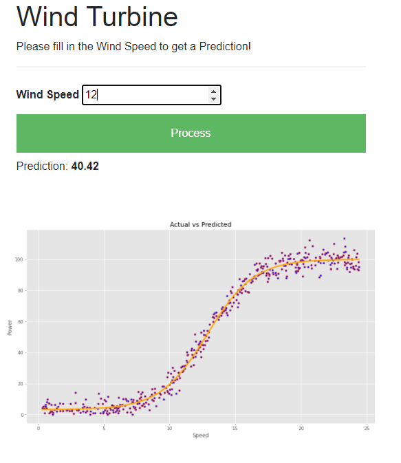
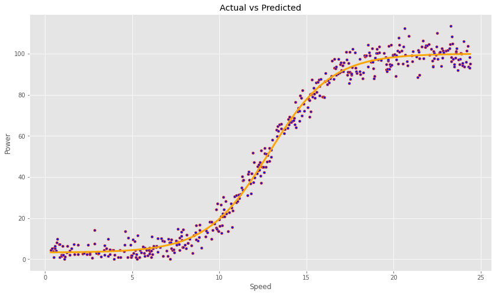

## Emerging Technologies Project


### Question
*************
In this project you must create a web service that uses machine learning to make predictions based on the data set powerproduction available on Moodle. The goal is to
produce a model that accurately predicts wind turbine power output from wind speed values, as in the data set. You must then develop a web service that will respond with predicted power values based on speed values sent as HTTP requests. Your submission must be in the form of a git repository containing, at a minimum, the following items:
1. Jupyter notebook that trains a model using the data set. In the notebook you
should explain your model and give an analysis of its accuracy.
2. Python script that runs a web service based on the model, as above.
3. Dockerfile to build and run the web service in a container.
4. Standard items in a git repository such as a README.
*************
### Introduction
*************
The Project is Web service that uses Machine Learning to make Predictions based on a Data Set. The Goal was to create a Model that arracutely predicts Wind Turbine Power from Wind Speed Values Entered by the User which is from the data set. The User can choose an Value in moderation fo the value in the data set. The Web service will respond to the User input and give a prediction on the model data that has been calculated.
<br>

*******************
### Technology
*******************
The Main Technogolies used in this Project are as follow:

* Flask

Flask is a micro web framework written in python and based on the werkzeug toolkit and jinja2 template engine. Flasks allows users to create web applications simply and fast. Flask has become extremely popular with python users and as of mid 2016 is the most popular python web development framework on github. For further info visit [Flask](https://flask.palletsprojects.com/en/1.1.x/#).

* Tensorflow

TensorFlow is an end-to-end open source platform for machine learning. It has a comprehensive, flexible ecosystem of tools, libraries and community resources that lets researchers push the state-of-the-art in ML and developers easily build and deploy ML powered applications. For further info visit [Tensorflow](https://www.tensorflow.org/).

Keras
Keras is an open-source software library that provides a Python interface for artificial neural networks. Keras acts as an interface for the TensorFlow library. For further info visit [Keras](https://keras.io/).
## Breakdown Steps
*******************
* 1: Design a Model to make pre-dictions based on the data set (powerproduction)

* 2: Create a Web Service that uses machine learning 

* 3: Goal is to Produce a model that accurately predicts wind turbine outpus(Wind Speed Values from the data set)

* 4: Then develop a Web service that will respond with the predicted power values basesd on speed values(HTTP requests)

* 5: Make a Docker Image and container to run on localhost

### Development of Project
*******************
#### Model - Linear Regression in Keras
This is generated on Jupyter Notebook.
1. First we import the libaries that is needed for the Project(Tensorflow, Numpy, Panda, Matplotlib).
2. Next we loaded in the data set and broke down the elements(Speed and Power) into x and y.
3. We will plot out what the dataset has to see what we are dealing with.
4. Define the Model which will be Keras Sequential which represents a linear grouping of layers.
5. Then Add the 3 classes that will make the layers dense and structured probably(Sigmoid and Linear).
6. Compile the model which is loss function called meaqn squared error.
7. Fit the Model and started with 100 epochs which gave a prediction but the accuracy wasnt that good. Later went up to 100 epochs gave back a better prediction.
8. Plotted the x and y data set(red dots) with the predict of the linear line with the prediction lineis the orange line(model.predict(y)). 
9. Saved the model in an h5 file for future reference.


#### Web-Service.py
This a Python File.
1. Import the necessary libaries(Flask, Tensorflow).
2. Created a New Web Application.
3. Connected or Get Request to the index.html file.
4. Created a POST request method which will get the Value that has been entered in the Input Field on the Web page.
5. Loaded in the Data file created in the model with prediction and then predicted the windspeed power from the model. Put into a list and returned to the User.
6. Finally Ran the Application.

#### Index.html
HTML and CSS and Javascript
1. Created the Web page which has a Input field and Text. Finally an Image of the Dta set Model that was produced in the model.
2. Adding styles.CSS to brighten up the Page with Colour.
3. Next A fetch API was created from Javascript to fetch the webpage created in the Web-Service.py page. Here the element that is in the input field is taken and Posted to there to run it through the data model of h5 and then send back to convert to a json string. All this is done when the button is clecked to get this function. 
4. If successful the Result of the Prdiction is calculated and the windspeed power is returned the User with Value on the Screen.

#### Docker
The Docker Image and Container needs to be created as stated in the How to Run the Application Section.

### How to Run The Application
*******************
There are multiple ways of running the project. 
1. Running the python command 
```python
python web-service.py
```
This will run the python file which will connect the index.html and can run it locally on 127.0.0.1:5000

2. Flask
Running Flask through python command.
```python
set FLASK_APP=web-service.py
python -m flask run
```
To run the application you can either use the flask command or python’s -m switch with Flask. Here Flask sets the python file to it and then runs it afterward.

3. Docker
Building Docker Image and Container through python command.
```python
# This will build the Image with Dockerfile and run the requirements within the Project guildlines.
docker build . -t model

# This will make the container so the user can run it on the extension of whatever port is added. 
# Then while made can be run on localhost 127.0.0.1 and the index.html page will be opened
docker run --name model-container -d -p 5000:5000 model
```

### Conclusion
*******************
This project ws tricky as there was a few components to set up before getting started. I had an issue with installing tensorflow, it wouldnt let me set up because i had a newer version of python which my computer didnt like one bit. The version of python is 3.8 which i had to downgrade to 3.7 to get it working properly. Once i had it installed then it was easy getting everything else working. The model was set up on jupyter notebook which i had been using for a while. The web service was set up on a python file which connected to a HTML file. Using Json to talk to the web service worked well which i used the Fetch API for post request. 
### Refernces
*******************
* Flask: https://flask.palletsprojects.com/en/1.1.x/quickstart/

* Tensorflow: https://www.tensorflow.org/

* Keras: https://keras.io/

* Models: https://www.machinelearningmindset.com/linear-regression-with-tensorflow/

https://github.com/ianmcloughlin/jupyter-teaching-notebooks/blob/master/keras-linear.ipynb

* Docker: https://www.docker.com/resources/what-container

* Fetch API: https://developer.mozilla.org/en-US/docs/Web/API/Fetch_API/Using_Fetch
